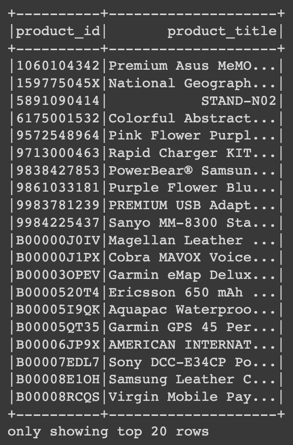
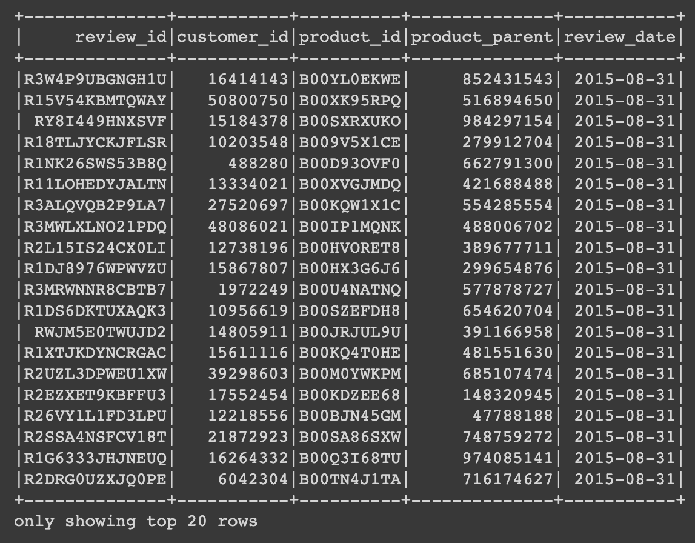
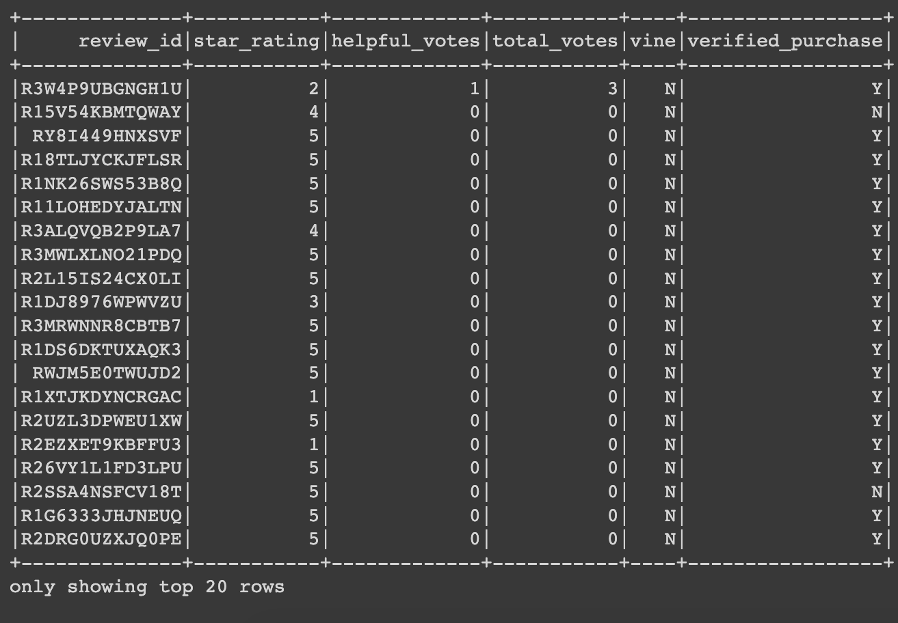
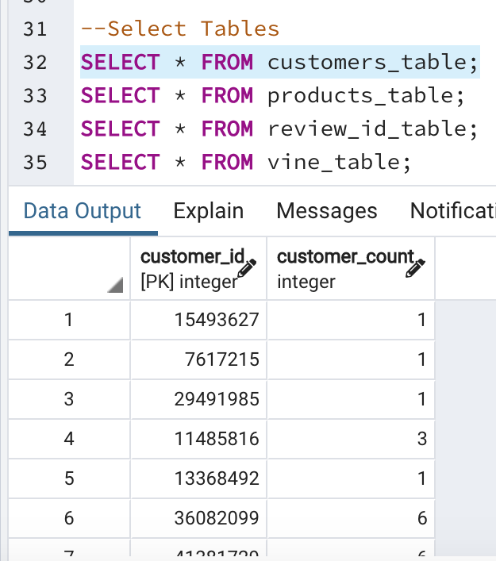
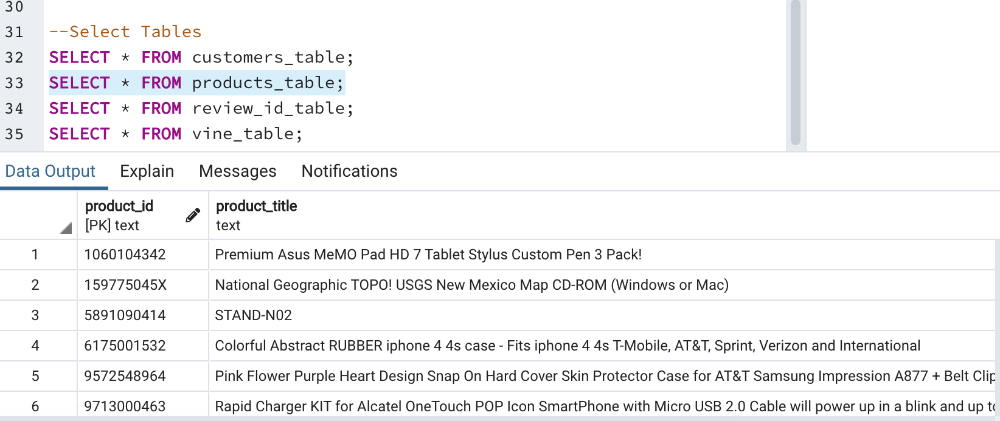
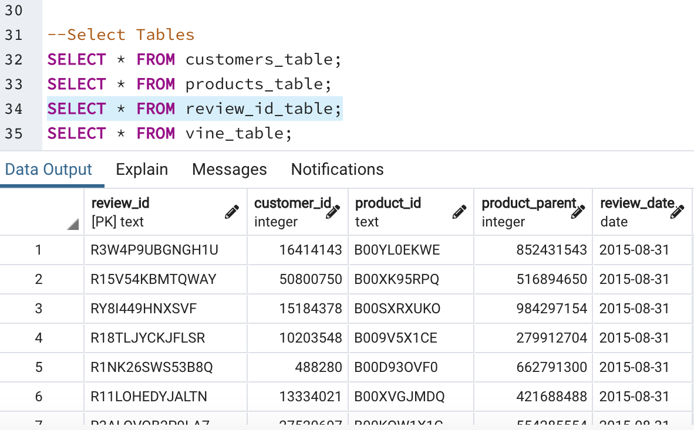
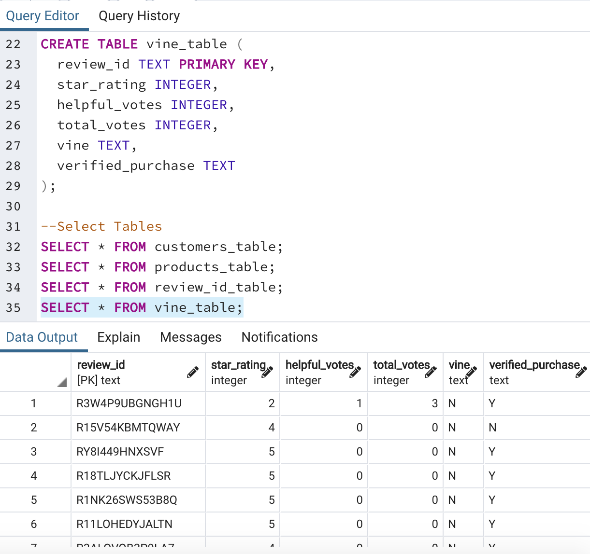

# Amazon Vine Analysis
## Puprose 
The purpose of this analysis is to choose from 50 datasets for Amazon Vine and use PySpark to perform the ETL process to extract the dataset, transform the data, connect to my AWS RDS instance, and load the transformed data into pgAdmin. I then used PySpark to determine if there was any bias toward favorable reviews from Vine members in my dataset.

## Results
### Deliverable 1: Perform ETL on Amazon Product Reviews
For this Deliverable, I created an AWS RDS database with tables in pgAdmin, picked a dataset from the link provided, and extracted the dataset into a data frame. I transformed the data frame into four separate data frames that mach the schema of pgAdmin. Finally, I uploaded the data into the appropriate tables and ran queries in pgAdmin.

#### Images for Deliverable 1
##### Customer Database

##### Product Database

##### Review Database

##### Vine Database

##### pgAdmin Tables
###### Customers Table

###### Products Table

###### Review ID Table

###### Vine Table 

### Deliverable 2: Determine Bias of Vine Reviews
Using PySpark (in Google Collaboratory), I determined any biases towards reviews that were written as part of the Vine program and if having a paid Vine review makes a difference in the percentage of 5-star reviews.
  - How many Vine reviews and non-Vine reviews were there?
  - How many Vine reviews were 5-stars? How many non-Vine reviews were 5 stars?
  - What percentage of Vine reviews were 5-stars? What percentage of non-Vine reviews were 5-stars?

#### Images for Deliverable 2
(insert D2 df here)

## Summary
Positivity bias for reviews in the vine program?

One additional analysis that I could do with the dataset to supposrt statement.

## Resources
- Google Colaboratory
- pgAdmin 4
- PySpark version 3.0.3
