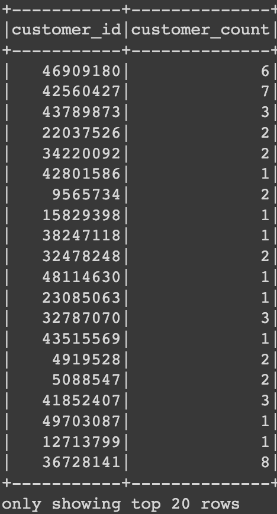
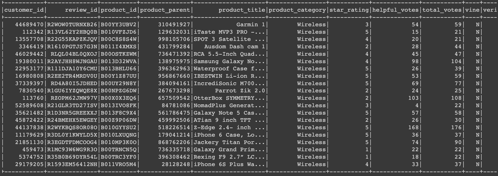
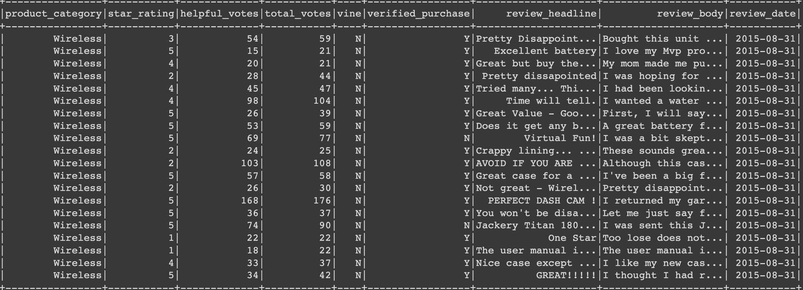
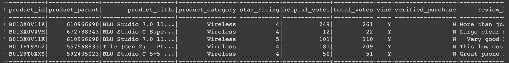
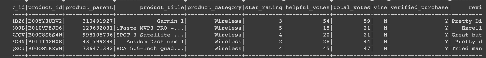

# Amazon Vine Analysis
## Puprose 
The purpose of this analysis is to choose from 50 datasets for Amazon Vine and use PySpark to perform the ETL process to extract the dataset, transform the data, connect to my AWS RDS instance, and load the transformed data into pgAdmin. I then used PySpark to determine if there was any bias toward favorable reviews from Vine members in my dataset.

## Results
### Deliverable 1: Perform ETL on Amazon Product Reviews
For this Deliverable, I created an AWS RDS database with tables in pgAdmin, picked a dataset from the link provided, and extracted the dataset into a data frame. I transformed the data frame into four separate data frames that mach the schema of pgAdmin. Finally, I uploaded the data into the appropriate tables and ran queries in pgAdmin.

#### Images for Deliverable 1
##### Customer Database

##### Product Database

##### Review Database

##### Vine Database

##### pgAdmin Tables
###### Customers Table

###### Products Table

###### Review ID Table

###### Vine Table 

### Deliverable 2: Determine Bias of Vine Reviews
Using PySpark (in Google Collaboratory), I determined any biases towards reviews that were written as part of the Vine program and if having a paid Vine review makes a difference in the percentage of 5-star reviews.
  - For Deliverable 2 there were:
    - 612 total Vine reviews
    - 64968 total non-Vine reviews
    - There were 222 total Vine 5-star reviews
    - There were 30543 total non-Vine 5-star reviews
    - The percentage of Vine 5-star reviews is 36.215 %
    - The percentage of non-Vine 5-star reviews are 47.012 % 
  

#### Images for Deliverable 2
##### Total Votes 

##### Helpful Votes 

##### Vine Paid Dataframe 

##### Vine Unpaid Dataframe 

##### Percentage of Vine Paid Reviews

##### Percentage of Vine Unpaid Reviews

## Summary
According to my data, despite the Vine percentages are around a third of the percentage, there is no positvity bias due to the fact that the percentage of non-Vine reviews still holding a majority of the percentage. Out of the 612 total Vine reviews, only 222 were 5-star (about 36%). On the other hand, out of 64968 non-Vine reviews, there were 30543 5 star non-Vine reviews (this calculates to around 47%). This shows that almost half of the reviews for non-Vine users were 5-stars! Overall, there are more non-Vine reviews as well as more total 5-star non-Vine reviews which proves there is no postivity bias for the Vine program.

In order to further back up this statement, I think we can also use extra visualizations to give others an easier time to understand what the data is trying to tell us. An example would be a stacking bar chart (to show the total 5-star reviews) or a pie chart (to show the percentages of the 5-star reviews). I think extra visualizations like these can show the amount of Vine users compared to the others who simply just leave reviews for products they liked. I still think that the Vine program is a necessity to make sure Amazon delivers the best products for whoever order them. 

## Resources
- Google Colaboratory
- pgAdmin 4
- PySpark version 3.0.3
